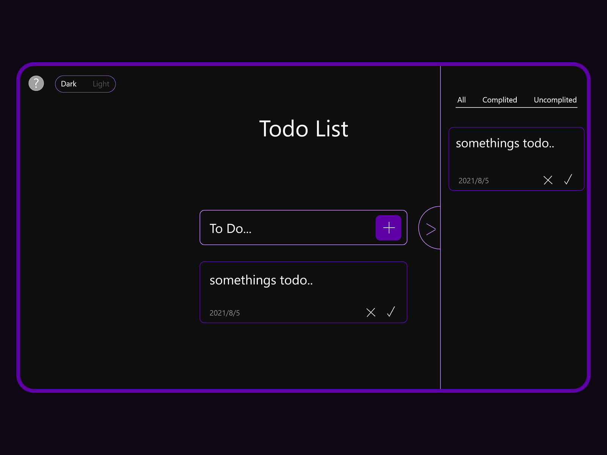

# Todo list with Vuejs

This project is a simple to-do list application built with Vue.js. It allows users to add, mark as completed, and delete tasks.

### Url

* [Todo Vuejs](https://simonjoseph.github.io/Todo-with-vue/) - See the todo list and test.

## Built With

* [Vuejs](https://vuejs.org/)
* [Javascript](https://www.javascript.com/)
* [Css](https://developer.mozilla.org/pt-BR/docs/Web/CSS)
* [Html](https://developer.mozilla.org/pt-BR/docs/Web/HTML)

## Authors

* **Simão Mateus**
